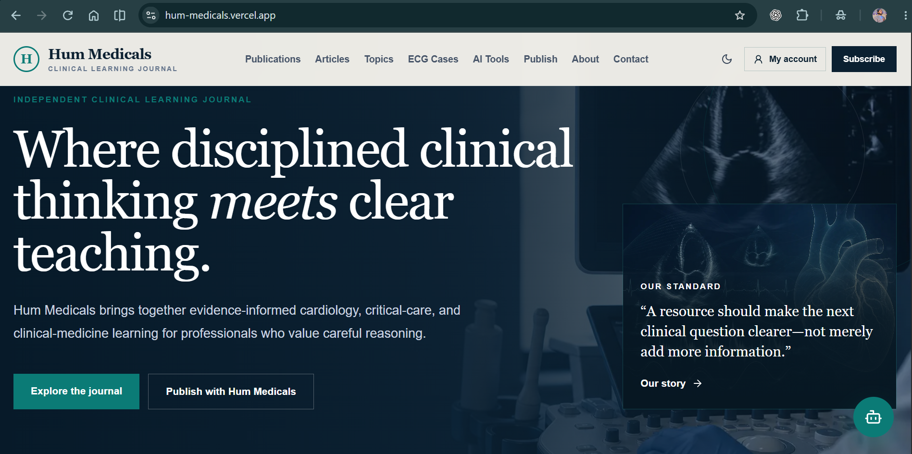
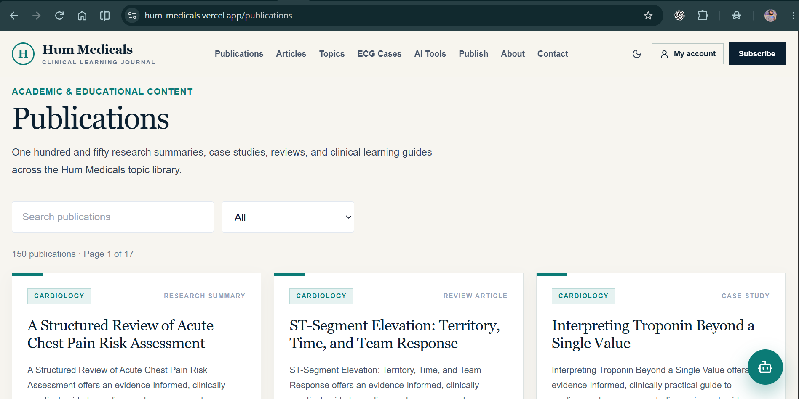
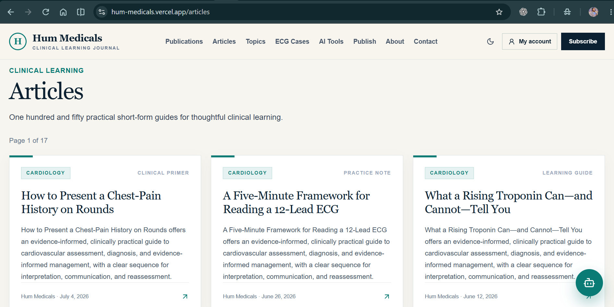
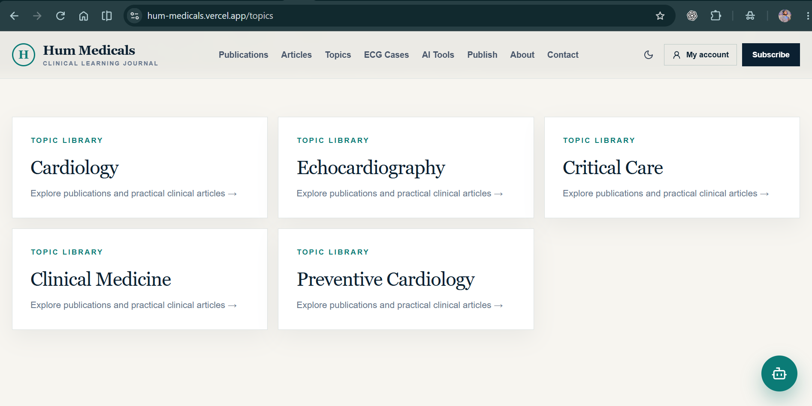
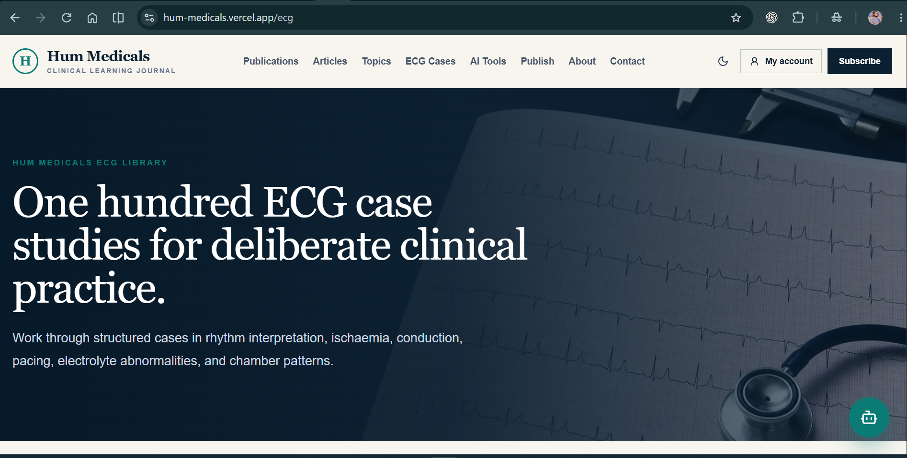
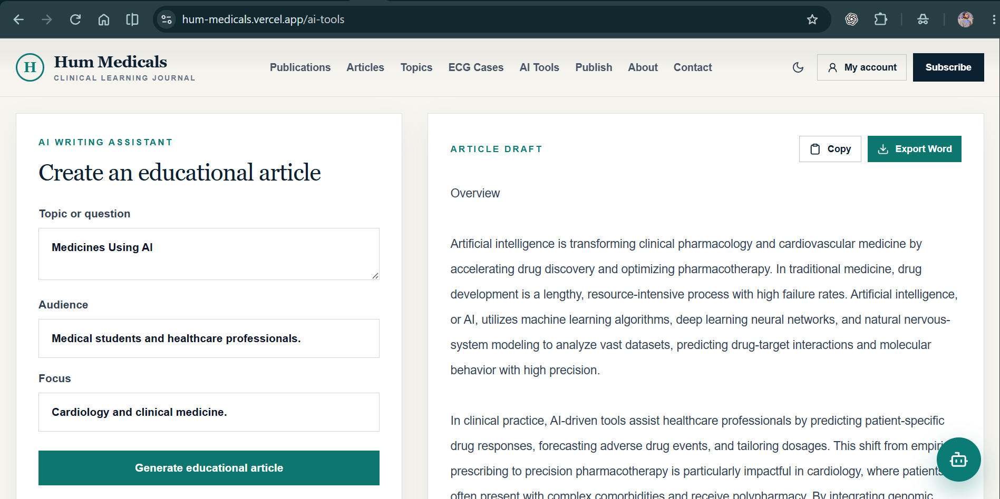
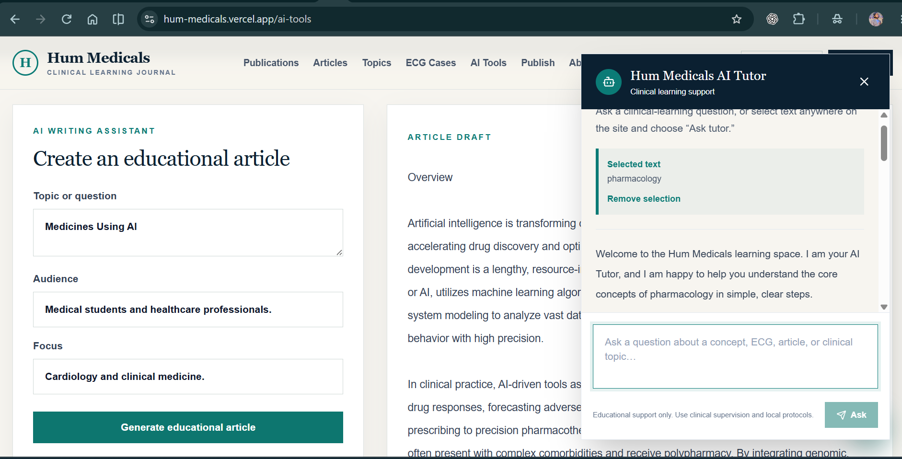
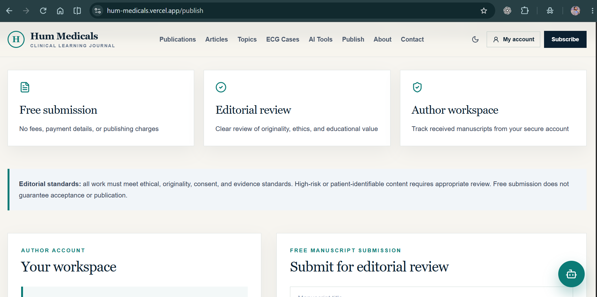
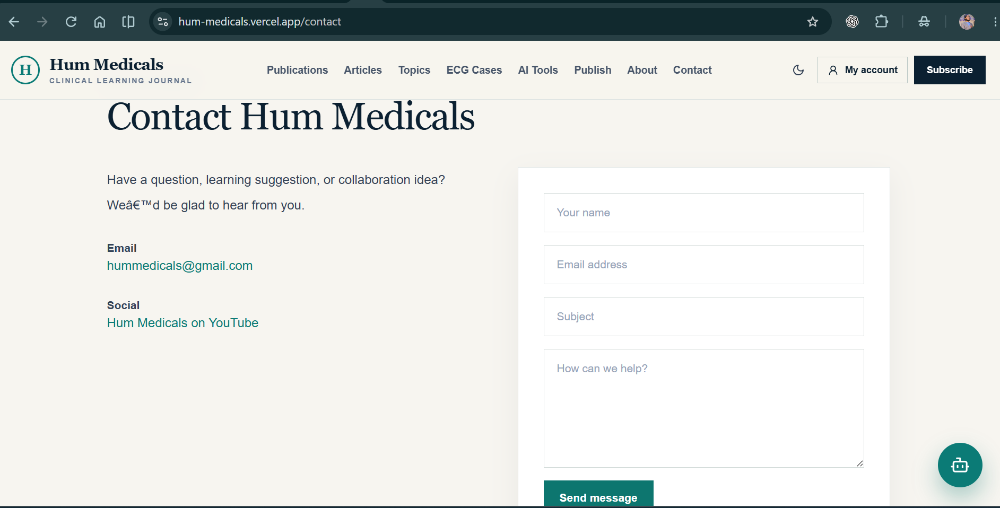

# Hum Medicals

Hum Medicals is a premium clinical-learning and publishing platform for medical students, trainees, educators, and healthcare professionals. It turns dense clinical learning into structured, accessible material while giving authors a free place to submit educational articles and research for editorial review.

## Live application

**[Open the live Hum Medicals website](https://hum-medicals.vercel.app/)**

The deployment was checked on 20 July 2026. The home page, publications, articles, ECG library, AI tools, publishing, sign-in, sign-up, and account routes all returned successful responses. The live Article Generator and AI Tutor were also verified with real Gemini responses. The current codebase also includes the complete-manuscript submission workflow, review-status tracker, contact fallback, and simplified subscription confirmation described below.

## The problem it solves

Clinical learners often face two connected problems: high-quality medical information can be difficult to study quickly, and early-career authors have limited, expensive routes to share useful educational work. Hum Medicals addresses both:

- It offers structured clinical reading, including ECG cases, publications, articles, and topic-led learning.
- It gives learners an in-context AI Tutor for explaining difficult text without leaving the page.
- It gives registered authors a free submission pathway and personal manuscript tracker.

## Features

### Clinical learning library

- 150 structured publications with dedicated detail pages.
- 150 practical medical articles with dedicated detail pages.
- 100 ECG case studies with interpretation sequences, differential diagnoses, learning points, and safety notes.
- Topic browsing across cardiology, echocardiography, critical care, and related clinical disciplines.
- Responsive premium editorial design, founder profile, contact details, YouTube channel, and social links.
- A dedicated Get started homepage that introduces the platform and routes new users to Sign up or existing users to Sign in.
- Signed-in visitors are redirected from the Get started homepage to their personal author workspace.
- The clinical library, AI tools, publishing, contact, and newsletter routes are protected behind a signed-in account; anonymous visitors can only access Get started, Sign in, and Sign up.
- Installable Progressive Web App (PWA): visitors can use **Install app** to add Hum Medicals to a desktop or mobile home screen, with an offline fallback page.

### AI learning and writing tools

- Gemini-powered AI Article Generator for plain-text educational article drafts.
- Clean output formatting that removes Markdown symbols, code blocks, and LaTex-style formulas.
- One-click Copy action for generated articles.
- Editable Microsoft Word export (`.docx`) for generated articles.
- Floating AI Tutor available on every page.
- Text-selection tutoring: select text anywhere on the site and choose **Ask tutor**.
- Manual tutoring: open the floating tutor and ask any clinical-learning question.

### Free author publishing

- Free author registration and sign-in with scrypt password hashing and signed HTTP-only sessions.
- No payment plans, checkout screens, or submission fees.
- Free submission of complete research articles, review articles, case studies, and educational articles.
- Submission validation for title, abstract, complete manuscript, type, originality, ethics, consent, and patient-identifiability acknowledgement.
- Unique submission reference and a clear `Submitted — Under Review` status after successful submission.
- Author workspace with a manuscript tracker, abstract, and expandable complete-paper view.
- Persistent production storage through Upstash Redis on Vercel; local JSON storage for development.

### Supporting features

- Newsletter subscription confirmation and welcome email when Resend is configured; otherwise a successful subscription acknowledgement.
- After a successful newsletter signup, the header Subscribe action changes to a persistent green `Subscribed` status on that browser/device.
- Contact page with `hummedicals@gmail.com`; when automated email is unavailable, the form opens a prefilled email draft addressed to Hum Medicals so the visitor can send the message directly.
- SEO metadata, sitemap, and robots configuration.
- Mobile-first, accessible controls, form labels, feedback messages, and keyboard-friendly interactions.

## AI implementation

Hum Medicals uses the Gemini API through server-side Next.js API routes. The Gemini API key is read only from server environment variables (`GEMINI_API_KEY`) and is never sent to the browser.

### Article Generator instruction

The Article Generator is instructed to create rigorous educational medical writing for the selected audience and focus. It uses these sections:

```text
Overview
Clinical context
Stepwise approach
Key interpretation points
Safety and limitations
Learning summary
```

The system instruction requires clear professional prose, plain-text output, no invented citations, no Markdown, no tables, no code blocks, no equations or LaTex, and no individual medical advice. It also instructs the model to state when specialist assessment and local protocols are required.

### AI Tutor instruction

The floating AI Tutor receives a learner's question and optional selected page text. It is instructed to provide concise, supportive, step-by-step clinical-learning explanations in plain text. It must not provide personal diagnosis or treatment, invent references, or replace qualified supervision, local protocols, or clinical assessment.

### AI model and configuration

```env
GEMINI_API_KEY=your-private-key
GEMINI_MODEL=gemini-3.5-flash
GEMINI_TUTOR_MODEL=gemini-3.1-flash-lite
```

Add these values to the Vercel Production environment, then redeploy. Never commit API keys or prefix the key with `NEXT_PUBLIC_`.

## Tools, services, and technologies

| Area | Used in Hum Medicals |
| --- | --- |
| Framework | Next.js 14 with the App Router |
| Language | TypeScript |
| Styling | Tailwind CSS |
| AI model | Google Gemini 3.5 Flash |
| AI integration | Google Gemini API, server-side `generateContent` requests |
| Deployment | Vercel |
| Web app installation | Web App Manifest and service worker (PWA) |
| Persistent production data | Upstash Redis through the Vercel Marketplace |
| Authentication | Node.js crypto scrypt hashes and signed HTTP-only session cookies |
| Word export | `docx` browser-side document generation |
| Icons | Lucide React |
| Visual assets | Custom medical visuals, supplied founder imagery, and the supplied Hum Medicals logo |

## Screenshots

All screenshots below were captured from the live Vercel deployment.

### Home



### Publications library



### Articles library



### Topic library



### ECG case library



### AI Article Generator with Copy and Word export



### Floating AI Tutor with selected-text context



### Free publishing workflow



### Contact page



## Run locally

### Requirements

- Node.js 20 or later
- A Gemini API key for AI functionality
- Upstash Redis credentials for production accounts, manuscript tracking, and newsletter records

### Installation

```bash
git clone <your-repository-url>
cd hum-medicals
npm install
```

Create `.env.local` in the project root:

```env
NEXT_PUBLIC_SITE_URL=http://localhost:3000
AUTH_SECRET=replace-with-a-long-random-secret
GEMINI_API_KEY=your-private-gemini-key
GEMINI_MODEL=gemini-3.5-flash
GEMINI_TUTOR_MODEL=gemini-3.1-flash-lite
RESEND_API_KEY=your-resend-api-key # optional: enables automatic email delivery
EMAIL_FROM=Hum Medicals <updates@your-verified-domain.com> # optional: must be a verified Resend domain
CONTACT_EMAIL=hummedicals@gmail.com
```

Run the development server:

```bash
npm run dev
```

Open [http://localhost:3000](http://localhost:3000).

### Install as an app

On the deployed HTTPS site, use **Install app** in the footer. Chromium browsers show the native installation prompt when available. On browsers without that prompt, use the browser menu and choose **Install app** or **Add to Home Screen**.

### Persistent accounts and submissions on Vercel

For production sign-in, sign-up, and free manuscript submission, install **Upstash Redis** from the Vercel Marketplace and connect it to the Hum Medicals Vercel project. It provides these environment variables automatically:

```env
KV_REST_API_URL=
KV_REST_API_TOKEN=
```

Also configure `AUTH_SECRET`, `GEMINI_API_KEY`, `GEMINI_MODEL`, `GEMINI_TUTOR_MODEL`, `CONTACT_EMAIL`, and `NEXT_PUBLIC_SITE_URL` for the **Production** environment. `RESEND_API_KEY` and `EMAIL_FROM` are optional; when supplied, `EMAIL_FROM` must use a domain verified in Resend and the website sends automated subscription and contact emails. Environment-variable changes require a new deployment.

## Build verification

```bash
npm run build
```

The project production build compiles all 430 routes successfully, including the installable web-app manifest, offline page, AI Article Generator, AI Tutor, free publishing submission endpoint, account workspace, 150 publications, 150 articles, and 100 ECG case pages.
